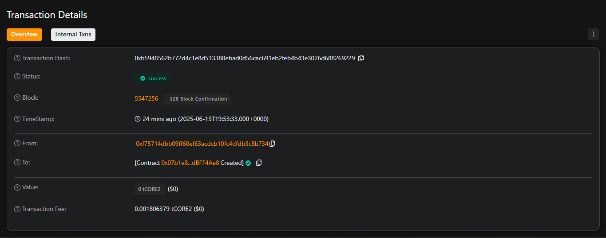

# Multi-Signature Wallet

## Project Description

The Multi-Signature Wallet is a smart contract-based security solution that requires multiple cryptographic signatures to authorize and execute transactions. Unlike traditional single-key wallets, this system distributes control among multiple owners, ensuring that no single party can unilaterally access or transfer funds. The contract implements a democratic approach to fund management where a predefined number of owners must agree before any transaction can be executed.

This project demonstrates advanced Solidity concepts including access control, state management, event handling, and secure transaction processing. The wallet supports multiple owners, customizable confirmation requirements, and comprehensive transaction tracking with the ability to submit, confirm, revoke, and execute transactions in a transparent and auditable manner.

## Project Vision

Our vision is to create a trustless, secure, and transparent financial infrastructure that eliminates single points of failure in digital asset management. By implementing multi-signature functionality, we aim to:

- **Enhance Security**: Protect against unauthorized access and reduce the risk of fund loss due to compromised private keys
- **Promote Collaboration**: Enable organizations, DAOs, and groups to collectively manage shared resources
- **Build Trust**: Provide transparency through on-chain transaction history and clear approval processes
- **Democratize Finance**: Make institutional-grade security accessible to individuals and small organizations
- **Foster Innovation**: Serve as a foundation for more complex DeFi protocols and governance mechanisms

## Key Features

### Core Functionality
- **Multi-Owner Architecture**: Support for multiple wallet owners with customizable confirmation requirements
- **Transaction Proposal System**: Any owner can propose transactions for group approval
- **Flexible Confirmation Process**: Configurable number of required confirmations (M-of-N signatures)
- **Transaction Execution**: Automatic execution once sufficient confirmations are received
- **Revocation Capability**: Owners can revoke their confirmations before transaction execution

### Security Features
- **Access Control**: Strict owner-only access to critical functions
- **State Validation**: Comprehensive transaction state checking and validation
- **Event Logging**: Complete audit trail through detailed event emissions
- **Reentrancy Protection**: Secure transaction execution patterns
- **Input Validation**: Robust parameter checking and error handling

### User Experience
- **Transaction History**: Complete record of all submitted, confirmed, and executed transactions
- **Real-time Status**: Live tracking of confirmation status for pending transactions
- **Flexible Data Support**: Support for both simple Ether transfers and complex contract interactions
- **Gas Optimization**: Efficient storage patterns and execution logic

## Future Scope

### Short-term Enhancements (3-6 months)
- **Emergency Recovery**: Implement time-locked emergency recovery mechanisms
- **Owner Management**: Add/remove owner functionality with consensus
- **Spending Limits**: Daily/monthly spending limits for different transaction types
- **Mobile Integration**: React Native app for mobile wallet management
- **Hardware Wallet Support**: Integration with Ledger and Trezor devices

### Medium-term Development (6-12 months)
- **Advanced Governance**: Weighted voting system based on stake or role
- **Multi-Chain Support**: Cross-chain transaction capabilities
- **DeFi Integration**: Direct integration with popular DeFi protocols
- **Batch Transactions**: Support for executing multiple transactions atomically
- **Social Recovery**: Social recovery mechanisms using trusted contacts

### Long-term Innovation (1-2 years)
- **AI-Powered Security**: Machine learning-based fraud detection and risk assessment
- **Zero-Knowledge Proofs**: Privacy-preserving transaction verification
- **Quantum Resistance**: Post-quantum cryptographic signature schemes
- **Regulatory Compliance**: Built-in compliance tools for institutional adoption
- **Decentralized Identity**: Integration with decentralized identity protocols

### Ecosystem Integration
- **DAO Tooling**: Integration with governance frameworks like Aragon and DAOhaus
- **Enterprise Solutions**: White-label solutions for corporate treasury management
- **Insurance Integration**: Smart contract insurance for additional security layers
- **Analytics Dashboard**: Comprehensive analytics and reporting tools
- **API Development**: RESTful APIs for third-party integrations

### Research Areas
- **Gas Optimization**: Advanced techniques for reducing transaction costs
- **Scalability Solutions**: Layer 2 integration for faster and cheaper transactions
- **Formal Verification**: Mathematical proofs of contract security and correctness
- **Interoperability**: Standards development for cross-platform compatibility

## Getting Started

### Prerequisites
- Node.js (v16 or later)
- Hardhat or Truffle development environment
- MetaMask or compatible Web3 wallet

### Installation
```bash
git clone <repository-url>
cd Multi-Signature-Wallet
npm install
```

### Deployment
```bash
npx hardhat compile
npx hardhat deploy --network <network-name>
```

### Testing
```bash
npx hardhat test
```

## License

This project is licensed under the MIT License - see the LICENSE file for details.

## Contributing

We welcome contributions! Please read our contributing guidelines and submit pull requests for any improvements.

## Support

For support and questions, please open an issue in the GitHub repository or contact our development team.

## 🚀 Deployment Information

### **Contract Details**
- **Contract Address:** `0x07b1e8358d8491A80217B48e491b132edBFF4Ae8`
- **Network:** Core Testnet 2
- **Transaction Hash:** `0xb5948562b772d4c1e8d533388ebad0d56cac691eb2feb4b43e3026d688269229`
- **Block Explorer:** [View on Core Scan](https://scan.test2.btcs.network/address/0x07b1e8358d8491A80217B48e491b132edBFF4Ae8)

### **Deployment Transaction**


### **Contract Verification**
The contract has been successfully deployed and verified on Core Testnet 2. You can interact with it using the following methods:

1. **Direct Contract Interaction:** Use Remix IDE with the deployed contract address
2. **Block Explorer:** View and interact through Core Scan
3. **Web3 Integration:** Connect using MetaMask and Web3.js/Ethers.js

### **Testing Instructions**
1. Connect MetaMask to Core Testnet 2
2. Ensure you have tCORE2 tokens from the faucet
3. Use the contract address above to interact with the deployed contract
4. Test basic functions: deposit, submit transaction, confirm, and execute
